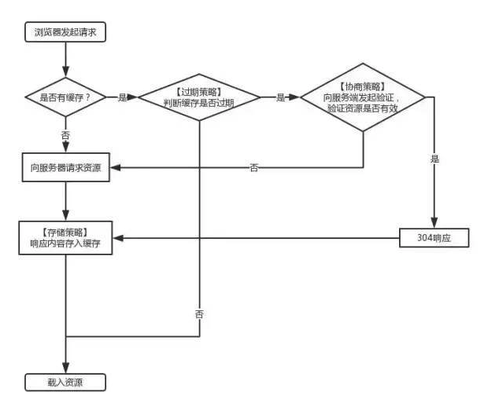

# 彻底搞懂浏览器缓存机制

前言
--

\[实践系列\] 主要是让我们通过实践去加深对一些原理的理解。

[实践系列-前端路由](https://link.segmentfault.com/?url=https%3A%2F%2Fjuejin.im%2Fpost%2F5c380afde51d4552232fb077)

[实践系列-Babel原理](https://link.segmentfault.com/?url=https%3A%2F%2Fjuejin.im%2Fpost%2F5c3beaee6fb9a04a027a9641)

[实践系列-Promises/A+规范](https://link.segmentfault.com/?url=https%3A%2F%2Fjuejin.im%2Fpost%2F5c41297cf265da613356d4ec)

有兴趣的同学可以关注 [实践系列](https://link.segmentfault.com/?url=https%3A%2F%2Fgithub.com%2Fwebfansplz%2Farticle) 。 求star求follow~

如果觉得自己已经掌握浏览器缓存机制知识的同学,可以直接看实践部分哈~

目录
--

 1. DNS 缓存   // 虽说跟标题关系不大,了解一下也不错
 2. CDN 缓存   // 虽说跟标题关系不大,了解一下也不错
 3. 浏览器缓存 // 本文将重点介绍并实践 

DNS 缓存
------

### 什么是DNS

全称 Domain Name System ,即域名系统。

> 万维网上作为域名和IP地址相互映射的一个分布式数据库，能够使用户更方便的访问互联网，而不用去记住能够被机器直接读取的IP数串。DNS协议运行在UDP协议之上，使用端口号53。

### DNS解析

简单的说,通过域名,最终得到该域名对应的IP地址的过程叫做域名解析（或主机名解析）。

www.dnscache.com (域名)  \- DNS解析 -\> 11.222.33.444 (IP地址)

### DNS缓存

有dns的地方,就有缓存。浏览器、操作系统、Local DNS、根域名服务器，它们都会对DNS结果做一定程度的缓存。

DNS查询过程如下:

1.  首先搜索浏览器自身的DNS缓存,如果存在，则域名解析到此完成。
2.  如果浏览器自身的缓存里面没有找到对应的条目，那么会尝试读取操作系统的hosts文件看是否存在对应的映射关系,如果存在，则域名解析到此完成。
3.  如果本地hosts文件不存在映射关系，则查找本地DNS服务器(ISP服务器,或者自己手动设置的DNS服务器),如果存在,域名到此解析完成。
4.  如果本地DNS服务器还没找到的话,它就会向根服务器发出请求,进行递归查询。

[戳此处详细了解DNS解析过程](https://link.segmentfault.com/?url=https%3A%2F%2Fblog.csdn.net%2Fcat_foursi%2Farticle%2Fdetails%2F71194397)

CDN 缓存
------

### 什么是CDN

全称 Content Delivery Network,即内容分发网络。

摘录一个形象的比喻,来理解CDN是什么。

> 10年前，还没有火车票代售点一说，12306.cn更是无从说起。那时候火车票还只能在火车站的售票大厅购买，而我所在的小县城并不通火车，火车票都要去市里的火车站购买，而从我家到县城再到市里，来回就是4个小时车程，简直就是浪费生命。后来就好了，小县城里出现了火车票代售点，甚至乡镇上也有了代售点，可以直接在代售点购买火车票，方便了不少，全市人民再也不用在一个点苦逼的排队买票了。

简单的理解CDN就是这些代售点(缓存服务器)的承包商,他为买票者提供了便利,帮助他们在最近的地方(最近的CDN节点)用最短的时间(最短的请求时间)买到票(拿到资源),这样去火车站售票大厅排队的人也就少了。也就减轻了售票大厅的压力(起到分流作用,减轻服务器负载压力)。

用户在浏览网站的时候，CDN会选择一个离用户最近的CDN边缘节点来响应用户的请求，这样海南移动用户的请求就不会千里迢迢跑到北京电信机房的服务器（假设源站部署在北京电信机房）上了。

### CDN缓存

关于CDN缓存,在浏览器本地缓存失效后,浏览器会向CDN边缘节点发起请求。类似浏览器缓存,CDN边缘节点也存在着一套缓存机制。CDN边缘节点缓存策略因服务商不同而不同，但一般都会遵循http标准协议，通过http响应头中的

Cache-control: max-age   //后面会提到

的字段来设置CDN边缘节点数据缓存时间。

当浏览器向CDN节点请求数据时，CDN节点会判断缓存数据是否过期，若缓存数据并没有过期，则直接将缓存数据返回给客户端；否则，CDN节点就会向服务器发出回源请求，从服务器拉取最新数据，更新本地缓存，并将最新数据返回给客户端。 CDN服务商一般会提供基于文件后缀、目录多个维度来指定CDN缓存时间，为用户提供更精细化的缓存管理。

### CDN 优势

1.  CDN节点解决了跨运营商和跨地域访问的问题，访问延时大大降低。
2.  大部分请求在CDN边缘节点完成，CDN起到了分流作用，减轻了源服务器的负载。
    
    [戳此处详细了解CDN工作过程](https://link.segmentfault.com/?url=http%3A%2F%2Fbook.51cto.com%2Fart%2F201205%2F338756.htm)
    

浏览器缓存(http缓存)
-------------

对着这张图先发呆30秒~  



### 什么是浏览器缓存


简单来说,浏览器缓存其实就是浏览器保存通过HTTP获取的所有资源,是浏览器将网络资源存储在本地的一种行为。

### 缓存的资源去哪里了?

你可能会有疑问,浏览器存储了资源,那它把资源存储在哪里呢？

#### memory cache

> MemoryCache顾名思义，就是将资源缓存到内存中，等待下次访问时不需要重新下载资源，而直接从内存中获取。Webkit早已支持memoryCache。  
> 目前Webkit资源分成两类，一类是主资源，比如HTML页面，或者下载项，一类是派生资源，比如HTML页面中内嵌的图片或者脚本链接，分别对应代码中两个类：MainResourceLoader和SubresourceLoader。虽然Webkit支持memoryCache，但是也只是针对派生资源，它对应的类为CachedResource，用于保存原始数据（比如CSS，JS等），以及解码过的图片数据。

#### disk cache

> DiskCache顾名思义，就是将资源缓存到磁盘中，等待下次访问时不需要重新下载资源，而直接从磁盘中获取，它的直接操作对象为CurlCacheManager。

*   |memory cache | disk cache

相同点

只能存储一些派生类资源文件

只能存储一些派生类资源文件

不同点

退出进程时数据会被清除

退出进程时数据不会被清除

存储资源

一般脚本、字体、图片会存在内存当中

一般非脚本会存在内存当中，如css等

**因为CSS文件加载一次就可渲染出来,我们不会频繁读取它,所以它不适合缓存到内存中,但是js之类的脚本却随时可能会执行,如果脚本在磁盘当中,我们在执行脚本的时候需要从磁盘取到内存中来,这样IO开销就很大了,有可能导致浏览器失去响应。**

#### 三级缓存原理 (访问缓存优先级)

1.  先在内存中查找,如果有,直接加载。
2.  如果内存中不存在,则在硬盘中查找,如果有直接加载。
3.  如果硬盘中也没有,那么就进行网络请求。
4.  请求获取的资源缓存到硬盘和内存。

### 浏览器缓存的分类

1.  强缓存
2.  协商缓存

浏览器再向服务器请求资源时,首先判断是否命中强缓存,再判断是否命中协商缓存!

### 浏览器缓存的优点

1.减少了冗余的数据传输

2.减少了服务器的负担，大大提升了网站的性能

3.加快了客户端加载网页的速度

### 强缓存

浏览器在加载资源时，会先根据本地缓存资源的 header 中的信息判断是否命中强缓存，如果命中则直接使用缓存中的资源不会再向服务器发送请求。

这里的 header 中的信息指的是 expires 和 cahe-control.

#### Expires

该字段是 **http1.0** 时的规范，它的值为一个**绝对时间**的 GMT 格式的时间字符串，比如 Expires:Mon,18 Oct 2066 23:59:59 GMT。这个时间代表着这个资源的失效时间，在此时间之前，即命中缓存。这种方式有一个明显的缺点，由于失效时间是一个绝对时间，所以当服务器与客户端时间偏差较大时，就会导致缓存混乱。

#### Cache-Control

Cache-Control 是 **http1.1** 时出现的 header 信息，主要是利用该字段的 **max-age** 值来进行判断，它是一个**相对时间**，例如 Cache-Control:max-age=3600，代表着资源的有效期是 3600 秒。cache-control 除了该字段外，还有下面几个比较常用的设置值：

**no-cache**：需要进行协商缓存，发送请求到服务器确认是否使用缓存。

**no-store**：禁止使用缓存，每一次都要重新请求数据。

**public**：可以被所有的用户缓存，包括终端用户和 CDN 等中间代理服务器。

**private**：只能被终端用户的浏览器缓存，不允许 CDN 等中继缓存服务器对其缓存。

**Cache-Control 与 Expires 可以在服务端配置同时启用，同时启用的时候 Cache-Control 优先级高。**

### 协商缓存

当强缓存没有命中的时候，浏览器会发送一个请求到服务器，服务器根据 header 中的部分信息来判断是否命中缓存。如果命中，则返回 304 ，告诉浏览器资源未更新，可使用本地的缓存。

这里的 header 中的信息指的是 Last-Modify/If-Modify-Since 和 ETag/If-None-Match.

#### Last-Modify/If-Modify-Since

浏览器第一次请求一个资源的时候，服务器返回的 header 中会加上 Last-Modify，Last-modify 是一个时间标识该资源的最后修改时间。

当浏览器再次请求该资源时，request 的请求头中会包含 If-Modify-Since，该值为缓存之前返回的 Last-Modify。服务器收到 If-Modify-Since 后，根据资源的最后修改时间判断是否命中缓存。

如果命中缓存，则返回 304，并且不会返回资源内容，并且不会返回 Last-Modify。

缺点:

短时间内资源发生了改变，Last-Modified 并不会发生变化。

周期性变化。如果这个资源在一个周期内修改回原来的样子了，我们认为是可以使用缓存的，但是 Last-Modified 可不这样认为,因此便有了 ETag。

#### ETag/If-None-Match

与 Last-Modify/If-Modify-Since 不同的是，Etag/If-None-Match 返回的是一个校验码。ETag 可以保证每一个资源是唯一的，资源变化都会导致 ETag 变化。服务器根据浏览器上送的 If-None-Match 值来判断是否命中缓存。

与 Last-Modified 不一样的是，当服务器返回 304 Not Modified 的响应时，由于 ETag 重新生成过，response header 中还会把这个 ETag 返回，即使这个 ETag 跟之前的没有变化。

**Last-Modified 与 ETag 是可以一起使用的，服务器会优先验证 ETag，一致的情况下，才会继续比对 Last-Modified，最后才决定是否返回 304。**

### 总结

当浏览器再次访问一个已经访问过的资源时，它会这样做：

1.看看是否命中强缓存，如果命中，就直接使用缓存了。

2.如果没有命中强缓存，就发请求到服务器检查是否命中协商缓存。

3.如果命中协商缓存，服务器会返回 304 告诉浏览器使用本地缓存。

4.否则，返回最新的资源。

实践加深理解
------

talk is cheap , show me the code 。让我们通过实践得真知~

**在实践时,注意浏览器控制台Network的 

按钮不要打钩。**

以下我们只对强缓存的Cache-Control和协商缓存的ETag进行实践,其他小伙伴们可以自己实践~

**package.json**
``` json
{
 "name": "webcache",
 "version": "1.0.0",
 "description": "",
 "main": "index.js",
 "scripts": {
   "cache": "nodemon ./index.js"
 },
 "author": "webfansplz",
 "license": "MIT",
 "devDependencies": {
   "@babel/core": "^7.2.2",
   "@babel/preset-env": "^7.2.3",
   "@babel/register": "^7.0.0",
   "koa": "^2.6.2",
   "koa-static": "^5.0.0"
 },
 "dependencies": {
   "nodemon": "^1.18.9"
 }
}
```
**.babelrc**
``` json
{
 "presets": [
   [
     "@babel/preset-env",
     {
       "targets": {
         "node": "current"
       }
     }
   ]
 ]
}
```
**index.js**
``` javascript
require('@babel/register');
require('./webcache.js');
```
**webcache.js**
``` javascript
import Koa from 'koa';
import path from 'path';
//静态资源中间件
import resource from 'koa-static';
const app = new Koa();
const host = 'localhost';
const port = 4396;
app.use(resource(path.join(__dirname, './static')));

app.listen(port, () => {
  console.log(`server is listen in ${host}:${port}`);
});
```
**index.html**
``` html
<!DOCTYPE html>
<html lang="en">
  <head>
    <meta charset="UTF-8" />
    <meta name="viewport" content="width=device-width, initial-scale=1.0" />
    <meta http-equiv="X-UA-Compatible" content="ie=edge" />
    <title>前端缓存</title>
    <style> .web-cache img {
        display: block;
        width: 100%;
      } </style>
  </head>
  <body>
    <div class="web-cache"></div>
  </body>
</html>
```
我们用koa先起个web服务器,然后用koa-static这个中间件做静态资源配置,并在static文件夹下放了index.html和web.png。

Ok,接下来我们来启动服务。
``` sh
npm run cache
```
server is listen in localhost:4396。 

接下来我们打开浏览器输入地址:
``` http
localhost:4396
```


完美~(哈哈,猪仔别喷我,纯属娱乐效果)

Ok!!!接下来我们来实践下**强缓存**。~

#### Cache-Control

**webcache.js**
``` javascript
import Koa from 'koa';
import path from 'path';
//静态资源中间件
import resource from 'koa-static';
const app = new Koa();
const host = 'localhost';
const port = 4396;

app.use(async (ctx, next) => {
 // 设置响应头Cache-Control 设置资源有效期为300秒
  ctx.set({
    'Cache-Control': 'max-age=300'  
  });
  await next();
});
app.use(resource(path.join(__dirname, './static')));

app.listen(port, () => {
  console.log(`server is listen in ${host}:${port}`);
});
```
  
我们刷新页面可以看到响应头的Cache-Control变成了max-age=300。

我们顺便来验证下**三级缓存原理**

我们刚进行了网络请求,浏览器把web.png存进了磁盘和内存中。

根据三级缓存原理,我们会先在内存中找资源，我们来刷新页面。


我们在红线部分看到了, from memory cache。nice~

ok,接下来,我们关掉该页面，再重新打开。因为内存是存在进程中的,所以关闭该页面,内存中的资源也被释放掉了,磁盘中的资源是永久性的,所以还存在。

根据三级缓存原理,如果在内存中没找到资源,便会去磁盘中寻找!


from disk cache !!! ok，以上也就验证了三级缓存原理,相信你对缓存资源的存储也有了更深的理解了。

我们刚对资源设置的有效期是300秒,我们接下来来验证缓存是否失效。

300秒后。。。


我们通过返回值可以看到,缓存失效了。

通过以上实践,你是否对强缓存有了更深入的理解了呢?

Ok!!!接下来我们来实践下**协商缓存**。~

由于Cache-Control的默认值就是no-cache(需要进行协商缓存，发送请求到服务器确认是否使用缓存。),所以我们这里不用对Cache-Control进行设置!

#### ETag
``` sh
//ETag support for Koa responses using etag.
npm install koa-tag -D
// etag works together with conditional-get
npm install koa-conditional-get -D
```
我们这里直接使用现成的插件帮我们计算文件的ETag值,站在巨人的肩膀上！

**webcache.js**
``` javascript
import Koa from 'koa';
import path from 'path';
//静态资源中间件
import resource from 'koa-static';
import conditional from 'koa-conditional-get';
import etag from 'koa-etag';
const app = new Koa();
const host = 'localhost';
const port = 4396;

// etag works together with conditional-get
app.use(conditional());
app.use(etag());
app.use(resource(path.join(__dirname, './static')));

app.listen(port, () => {
 console.log(`server is listen in ${host}:${port}`);
});
```
ok。第一次请求.  
 
我们发现返回值里面已经有了Etag值。

接下来再请求的时候,浏览器将会带上If-None-Match请求头,并赋值为上一次返回头的Etag值,然后与 这次返回值的Etag值进行对比。如果一致则命中协商缓存。返回304 Not Modified。接下来我们来验证一下~

 
ok,如图所示,完美验证了上面的说法。

接下来我们修改web.png ,来验证是否资源改变时 协商缓存策略也就失效呢？


如图所示.协商缓存的实践也验证了原理。

### 大功告成

写文章真的是件挺累的事,如果觉得有帮助到你,请给star/follow 支持下作者~

[源码地址](https://link.segmentfault.com/?url=https%3A%2F%2Fgithub.com%2Fwebfansplz%2Farticle%2Ftree%2Fmaster%2FwebCache)

### 参考文献

[前端性能优化之缓存利用](https://link.segmentfault.com/?url=https%3A%2F%2Fwww.haorooms.com%2Fpost%2Fcache_huancunliyong)## 目标

去除 iconfinder 上 icon 的水印

### 原理

利用水印像素点和原图像素点颜色合并的原理，如果拥有加过水印的图片和水印图片，就可以反向推出原图原像素点的颜色；前提是你得拥有他的水印图片
