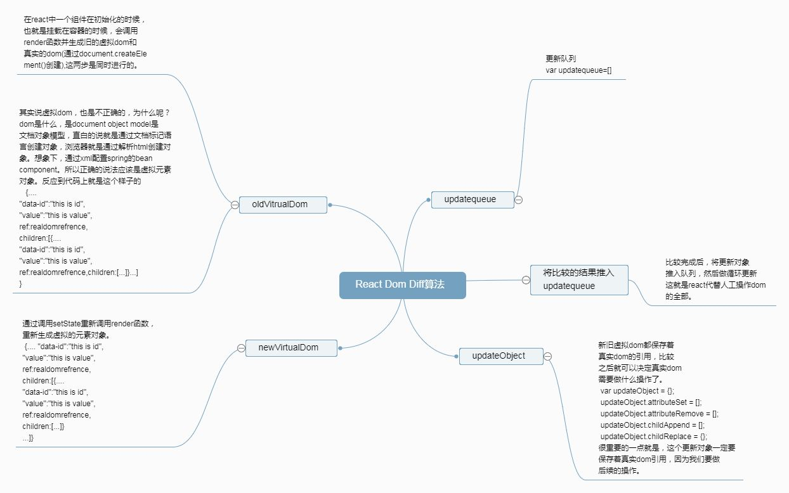

# React Dom Diff 算法以及实现

## 1.算法的架构流程
算法中的reactHtKey和react的key作用相同，有key可以直接拿索引进行比对，无key则按照顺序进行比对。



## 2.什么是虚拟dom
虚拟dom就是一个简单的js对象，其最大的作用就是用来作dom diff 算法的，实现算法操作dom，从而实现代替人为操作的目的。 


## 3.代码实现部分
A. 如果是组件化设计，顶层设计是十分必要的，这里只讲算法的实现部分，对顶层设计暂时不涉及。

``` js
/**
 * 
 * 组件的顶层设计
 * 
 */
  function ReactHt() {

  };

  ReactHt.prototype = {
      constructor: ReactHt
  };

```

B. 创建虚拟dom

``` js
/***
 * 添加一些静态方法 createElement;
 * 创建virtual dom;
 * @param(tag) 为html tag;
 * @param(props) @type(object=>{"data-id":"this is attrid"}) 为此组件（元素）props,又称attribute;
 * @param(children)) @type(array=>[reactHtElement],string=>"text") 为此组件的children;
 * 如果第二个参数类型为string,则其将被当作文本节点
 *
 * 如果传递的是class，则必须要在props上写明className
 * 因为class是关键字
 *
 */
ReactHt.createElement = function (tag, props, children) {
  if (arguments.length === 0) return null;
  if (arguments.length === 1) {
      console.warn("only one argument can't create element");
      return null;
  }
  var dom = document.createElement(tag), virtualDom = {ref: dom, tag: tag}, propsOrChildren = arguments[1],
      children = arguments[2];

  /**
   *
   * 如果第二个参数是数组，则为此虚拟dom的children
   *
   * **/
  if (propsOrChildren.isArray()) {

      //对接虚拟dom的children
      virtualDom.children = propsOrChildren.length === 0 ? null : propsOrChildren;

      //将children append进其父元素
      propsOrChildren.forEach(function (child) {
          dom.appendChild(child.ref);
      });
  } else if (propsOrChildren.isString() || propsOrChildren.isNumber()) {//如果第二个参数类型是string或者number,则为此虚拟dom的文本节点

      //对接虚拟dom的children
      virtualDom.children = propsOrChildren;

      virtualDom.style = {};

      dom.innerText = propsOrChildren;
  } else if (propsOrChildren.isObject()) {
      /***
       *
       * 如果第二个参数是Object，则为此虚拟dom的属性
       * 我们将key设置在这里
       *
       * */


      //在此链接虚拟dom的key
      /**
       *
       * 在此 key应该是稳定的，如果将array的index作为key
       * 则可能会引起真实dom的状态丢失,因为在这里key相当于一个索引。
       * 过滤undefined或者null的key
       * **/
      if (propsOrChildren.hasOwnProperty("key") && propsOrChildren["key"] !== undefined && propsOrChildren["key"] !== null) {
          virtualDom["reactHtKey"] = propsOrChildren["key"];
          propsOrChildren["reactHtKey"] = propsOrChildren["key"];
      }

      //如果没有style,则将style设置为一个空的对象
      if (!propsOrChildren["style"]) propsOrChildren["style"] = {};

      Object.keys(propsOrChildren).forEach(function (key) {


          //创建虚拟dom的props
          virtualDom[key] = propsOrChildren[key];

          if (key !== "innerTHML" && key !== "key" && key !== "reactHtKey" && key !== "style") {
              if (key === "className") {
                  dom.setAttribute("class", propsOrChildren[key]);
                  return;
              }
              dom.setAttribute(key, propsOrChildren[key]);
              return;
          }


          //创建style
          if (key === "style") {
              Object.keys(propsOrChildren["style"]).forEach(function (styleProperty) {
                  dom.style[styleProperty] = propsOrChildren["style"][styleProperty];
              });
              return;
          }
          ;

          //如果children不为null，undefined,false
          if (propsOrChildren[key] && propsOrChildren[key] !== true)
              dom.innerHTML = propsOrChildren[key];
      });
  } else {
      throw new TypeError("arguments[1] error,only array,string or object is allowed");
  }

  if (children) {
      if (children.isArray()) {

          //对接虚拟dom的children
          virtualDom.children = children.length === 0 ? null : children;

          children.forEach(function (child) {
              dom.appendChild(child.ref);
          });
      } else if (children.isString() || children.isNumber()) {

          //对接虚拟dom的children
          virtualDom.children = children;

          dom.innerText = children;
      } else {
          throw new TypeError("arguments{} error,only array,string or number is allowed");
      }
  } else {
    /**
     * 
     * 如果children为null或者undefined或者为false都将被设置为空
     * inpput,canvas,contentEditable
     * 
     * */
    if(propsOrChildren.isObject())
        virtualDom.children = null;
  }

  return virtualDom;
}
```

C. 声明一个更新队列
```js
//更新队列
/***
* 更新队列，将需要更新的dom，更新形式推入队列
* 做批量更新
*
* eg:{}
*
* */
var updateQueue = [];
```

D. dom diff算法的主体，将比较之后得到的操作对象推入队列，做后续的更新。
```js
/**
 * react core dom diff 算法实现
 * @param(newVirtualDom)setState产生的新的virtual dom
 * @param(oldVirtualDom)组件初始化时保存的虚拟dom
 * @return(updateQueue) 返回结果为一个更新队列，因为旧有的virtual dom保存着真实dom的refrence，所以可以做到平行
 */
function domDiff(newVirtualDom, oldVirtualDom) {
  if (arguments.length !== 2) {
    throw new Error(
      "input parameter error,the argument's length must be equal two"
    );
  }
  if (!newVirtualDom.isObject() || !oldVirtualDom.isObject()) {
    throw new Error("input parameter must be reactHt component");
  }

  var argumentsCallee = arguments.callee;

  //update object
  var updateObject = {};
  updateObject.attributeSet = [];
  updateObject.attributeRemove = [];
  updateObject.childAppend = [];
  updateObject.childReplace = {};
  /**
   *
   * 在有key的情况下，我们可以找出新child插入的准确位置
   * 而不用更新整个旧的虚拟dom children对应的真实dom
   *
   * **/
  updateObject.childInsert = [];

  /**
   *
   * 如果等待insert的虚拟dom的nextSibling为null
   * 则其操作为append
   *
   * ***/
  updateObject.childAppendForInsert = [];
  updateObject.childRemove = [];
  /***
   *
   * 单纯的textReplace
   *
   * */
  updateObject.textReplace = null;

  /***
   *
   * 全部的child代替
   *
   * */
  updateObject.childRefresh = [];

  /****
   *
   * style重设更新
   *
   *
   *
   * ***/
  updateObject.styleReset = [];

  /**
   *
   * style移除操作
   *
   * */
  updateObject.styleRemove = [];

  /****
   *
   * 比对虚拟dom的className，也是attribute，故可以将其他放在attribute的操作中
   *
   * **/

  var newKeys = Object.keys(newVirtualDom),
    oldKeys = Object.keys(oldVirtualDom);

  //first filter property like children,reference,tag ,we will handle it specially
  var _newKeys = newKeys.filter(function (_newKey) {
      return (
        _newKey !== "children" &&
        _newKey !== "ref" &&
        _newKey !== "tag" &&
        _newKey !== "key" &&
        _newKey !== "reactHtKey" &&
        _newKey !== "style"
      );
    }),
    _oldKeys = oldKeys.filter(function (_oldKey) {
      return (
        _oldKey !== "children" &&
        _oldKey !== "ref" &&
        _oldKey !== "tag" &&
        _oldKey !== "key" &&
        _oldKey !== "reactHtKey" &&
        _oldKey !== "style"
      );
    });

  /****
   * 如果新旧virtual dom的children属性的同级child标签不同，则做替换操作
   * 对应的操作就是replaceChild
   * 加入替换更新队列
   * 加入旧virtual dom的reference,等待操作
   * 因为tag不同所以我们做整个的替换操作(引用类型值)
   * *****/
  if (newVirtualDom.tag !== oldVirtualDom.tag) {
    updateObject.childReplace.oldChild = oldVirtualDom.ref;
    updateObject.childReplace.newChild = newVirtualDom.ref;
    //因为tag不同所以需要做整个的新旧virtual dom的替换操作
    oldVirtualDom = newVirtualDom;
  }

  /***
   *
   * 对比style的不同,如果新的style key不在旧的style的keys集合上
   * 或者新旧style的值不同
   * 则设置新的style
   *
   * */
  Object.keys(newVirtualDom.style).forEach(function (styleKey) {
    if (Object.keys(oldVirtualDom.style).indexOf(styleKey) < 0) {
      updateObject.styleReset.push({
        styleKey: styleKey,
        styleValue: newVirtualDom.style[styleKey],
      });
      oldVirtualDom.style[styleKey] = newVirtualDom.style[styleKey];
    } else {
      if (newVirtualDom.style[styleKey] !== oldVirtualDom.style[styleKey]) {
        updateObject.styleReset.push({
          styleKey: styleKey,
          styleValue: newVirtualDom.style[styleKey],
        });
        oldVirtualDom.style[styleKey] = newVirtualDom.style[styleKey];
      }
    }
  });

  /**
   *
   * 如果旧的style的key不在新的style的keys集合上则做remove操作
   *
   * **/
  Object.keys(oldVirtualDom.style).forEach(function (styleKey) {
    if (Object.keys(newVirtualDom.style).indexOf(styleKey) < 0) {
      updateObject.styleRemove.push(styleKey);
      delete oldVirtualDom.style[styleKey];
    }
  });

  /**
   * 对于元素的attribute只有两个操作，一个是setAttribute,另一个是removeAttribute
   * 这是对应的第一种情况，新的key肯定不在旧的key中
   * */
  _newKeys.forEach(function (_newKey) {
    if (_oldKeys.indexOf(_newKey) < 0) {
      updateObject.attributeSet.push({
        attrKey: _newKey,
        attrValue: newVirtualDom[_newKey],
      });

      //更新旧的虚拟dom
      oldVirtualDom[_newKey] = newVirtualDom[_newKey];
    }
  });

  /**
   *
   * 对应第二种情况，旧的key如果不在新的keys当中，则其操作是remove
   * 第三种情况oldkey都在newKeys当中，但是值不同，和第一种情况操作相同(setAttribute)
   *
   * */

  _oldKeys.forEach(function (_oldKey) {
    if (_newKeys.indexOf(_oldKey) < 0) {
      updateObject.attributeRemove.push(_oldKey);

      //更新旧的虚拟dom
      delete oldVirtualDom[_oldKey];
    } else {
      //需要更新attribute
      if (oldVirtualDom[_oldKey] !== newVirtualDom[_oldKey]) {
        updateObject.attributeSet.push({
          attrKey: _oldKey,
          attrValue: newVirtualDom[_oldKey],
        });
        //更新旧的虚拟dom
        oldVirtualDom[_oldKey] = newVirtualDom[_oldKey];
      }
    }
  });

  /**
   *
   * children都不为空，才能进入接下来的比对。
   *
   * **/
  if (newVirtualDom.children && oldVirtualDom.children) {
    /***
     *
     * 这个比对的方法是按照顺序进行比对，肯定有问题。
     * 如果加了key，那可以很稳定的进行比对,同样可以提升性能。(这就是为什么react推荐key原因)
     * 这边还有一种情况就是旧的虚拟dom的children有两个，新的只有一个
     * {"data-id":"huangtao"",ref:domReference,children:[{...}]} =>virtual dom
     *
     * */
    if (newVirtualDom.children.isArray() && oldVirtualDom.children.isArray()) {
      //如果新旧virtual dom 所含子元素 的length相同
      if (newVirtualDom.children.length === oldVirtualDom.children.length) {
        for (var i = 0, len = newVirtualDom.children.length; i < len; i++) {
          //进入递归处理
          argumentsCallee(newVirtualDom.children[i], oldVirtualDom.children[i]);
        }
      } else {
        /***
         *
         * 如果新旧virtual dom 所含子元素 的length不同
         * situation one 如果newVirtualDom的children的length大于oldVirtual children的length
         * 如果没有key（只要满足条件newVirtualDom的children中有一个无key这种条件即可）
         * 则将newVirtualDom的children整个插入到oldVirtualDom的children中
         *
         * */
        if (newVirtualDom.children.length > oldVirtualDom.children.length) {
          /***
           *
           * 如果没有reactHtKey，则按照顺序进行比对，进入递归处理，repalceChild,setAttribute...
           * 剩下的做appendChild操作
           * 待优化...
           *
           * */
          if (
            newVirtualDom.children.some(function (newChild) {
              return !Object.prototype.hasOwnProperty.call(
                newChild,
                "reactHtKey"
              );
            })
          ) {
            newVirtualDom.children.forEach(function (
              newViutualDomChild,
              index
            ) {
              if (oldVirtualDom.children[index] !== undefined) {
                //进入递归处理
                argumentsCallee(
                  newViutualDomChild,
                  oldVirtualDom.children[index]
                );
              } else {
                updateObject.childAppend.push(newViutualDomChild.ref);
                //更新旧的virtualdom children
                oldVirtualDom.children.push(newViutualDomChild);
              }
            });
          } else {
            //如果有reactHtKey

            //比较具有相同reactHtKey的virtualDom
            newVirtualDom.children.forEach(function (newChildVirtual) {
              var oldVirtualDomChild = findVirtualDom(
                newChildVirtual.reactHtKey,
                oldVirtualDom.children
              );
              if (
                oldVirtualDomChild !== undefined &&
                newChildVirtual.reactHtKey === oldVirtualDomChild.reactHtKey
              ) {
                argumentsCallee(newChildVirtual, oldVirtualDomChild);
              }
            });

            var newChildPositionArr = findNewChildPosition(
              oldVirtualDom.children,
              newVirtualDom.children
            );

            //将要插入旧列表的新child推入insert更新队列
            newChildPositionArr.forEach(function (updateReactKeyObj) {
              /***
               *
               * 找到此key在旧虚拟dom中children中对应的child，我们需要其真实dom引用做insertBefore操作
               *
               * */
              if (updateReactKeyObj.nextSiblingKey !== null) {
                var childForUpdateFromNewVirtualDom = findVirtualDom(
                  updateReactKeyObj.updateChildKey,
                  newVirtualDom.children
                );
                var childForGetPositionFromOldVirtualDom = findVirtualDom(
                  updateReactKeyObj.nextSiblingKey,
                  oldVirtualDom.children
                );

                /***
                 *
                 * 如果两个虚拟dom都在末尾插入,比如[1,2]=>[1,2,3]=>[1,2,3,4];
                 * 虽然第三个virtualDom找到了nextSibling 但nextSibling还没插入到真实dom中,对应的是
                 * childForGetPositionFromOldVirtualDom为undefined
                 * 这种情况直接走childAppendForInsert更新对列
                 * **/
                if (!childForGetPositionFromOldVirtualDom) {
                  updateObject.childAppendForInsert.push({
                    updateChild: childForUpdateFromNewVirtualDom.ref,
                    insertBeforeOldDom: oldVirtualDom.children[0].ref,
                  });
                  //更新旧的virtualdom
                  oldVirtualDom.children.push(childForUpdateFromNewVirtualDom);
                  return;
                }

                updateObject.childInsert.push({
                  updateChild: childForUpdateFromNewVirtualDom.ref,
                  insertBeforeOldDom: childForGetPositionFromOldVirtualDom.ref,
                });
                //需要同步更新旧的虚拟dom的children，以保证接下来待插入dom在旧virtualdom的children中能被正确索引
                oldVirtualDom.children.splice(
                  oldVirtualDom.children.findIndex(function (child) {
                    return (
                      child.reactHtKey === updateReactKeyObj.nextSiblingKey
                    );
                  }),
                  0,
                  childForUpdateFromNewVirtualDom
                );
              } else {
                //在末尾插入
                var childForUpdateFromNewVirtualDom = findVirtualDom(
                  updateReactKeyObj.updateChildKey,
                  newVirtualDom.children
                );
                updateObject.childAppendForInsert.push({
                  updateChild: childForUpdateFromNewVirtualDom.ref,
                  insertBeforeOldDom: oldVirtualDom.children[0].ref,
                });
                //更新旧的virtualdom
                oldVirtualDom.children.push(childForUpdateFromNewVirtualDom);
              }
            });
          }
        } else {
          /***
           * 当新的virtualDom的children的length小于旧的virtual dom的children的length
           * 如果没有reactHtKey，则按照顺序进行比对，进入递归处理，repalceChild,setAttribute...
           * 剩下的全部做removeChild操作
           * 等待优化
           *
           * */
          if (
            newVirtualDom.children.some(function (newChild) {
              return !Object.prototype.hasOwnProperty.call(
                newChild,
                "reactHtKey"
              );
            })
          ) {
            oldVirtualDom.children.forEach(function (
              oldViutualDomChild,
              index
            ) {
              if (newVirtualDom.children[index] !== undefined) {
                //进入递归处理
                argumentsCallee(
                  newVirtualDom.children[index],
                  oldViutualDomChild
                );
              } else {
                updateObject.childRemove.push(oldViutualDomChild.ref);
                //更新旧的virtualdom children
                oldVirtualDom.children.pop(oldViutualDomChild);
              }
            });
          } else {
            //TODO:如果有reactHtKey的情况
            /***
             *
             * 如果在有稳定的reactHtKey的情况下,根据reactHtKey找出需要移除的dom
             * 剩下的做递归处理
             *
             * **/
            //比较具有相同reactHtKey的virtualDom
            oldVirtualDom.children.forEach(function (oldVirtualDomChild) {
              var newVirtualDomChild = findVirtualDom(
                oldVirtualDomChild.reactHtKey,
                newVirtualDom.children
              );
              if (
                newVirtualDomChild !== undefined &&
                oldVirtualDomChild.reactHtKey === newVirtualDomChild.reactHtKey
              ) {
                //进入递归处理
                argumentsCallee(newVirtualDomChild, oldVirtualDomChild);
              } else {
                //不在新newVirtualDom children做removeChild操作
                updateObject.childRemove.push(oldVirtualDomChild.ref);

                //更新旧的虚拟dom
                oldVirtualDom.children = oldVirtualDom.children.removeEl(
                  function (oldVirtualDomChild) {
                    return (
                      oldVirtualDomChild.reactHtKey ===
                      oldVirtualDomChild.reactHtKey
                    );
                  }
                );
              }
            });
          }
        }
      }
    }

    //如果新旧虚拟dom的children都是text
    if (
      newVirtualDom.children.isString() &&
      oldVirtualDom.children.isString() &&
      newVirtualDom.children !== oldVirtualDom.children
    ) {
      updateObject.textReplace = newVirtualDom.children;
      //更新旧virtual dom的children
      oldVirtualDom.children = newVirtualDom.children;
    }
  }

  /**
   *
   * 如果新旧虚拟dom的children都不存在
   *
   * */
  /****
   * 如果新的children是array,旧的虚拟dom的children是string
   */
  if (newVirtualDom.children !== null || oldVirtualDom.children !== null) {
    if (
      newVirtualDom.children !== null &&
      newVirtualDom.children.isArray() &&
      (oldVirtualDom.children === null || oldVirtualDom.children.isString())
    ) {
      newVirtualDom.children.forEach(function (newChild) {
        updateObject.childRefresh.push(newChild.ref);
      });

      //更新旧virtual dom的children
      oldVirtualDom.children = newVirtualDom.children;
    }

    /***
     * 如果新的children是string(text)，旧的虚拟dom的children是array
     *
     * */
    if (
      (newVirtualDom.children === null || newVirtualDom.children.isString()) &&
      (oldVirtualDom.children === null || oldVirtualDom.children.isArray())
    ) {
      updateObject.childRefresh.push(newVirtualDom.children);

      //更新旧virtual dom的children
      oldVirtualDom.children = newVirtualDom.children;
    }
  }

  if (
    updateObject.attributeSet.length === 0 &&
    updateObject.attributeRemove.length === 0 &&
    updateObject.childAppend.length === 0 &&
    Object.isEmpty(updateObject.childReplace) &&
    updateObject.childInsert.length === 0 &&
    updateObject.childAppendForInsert.length === 0 &&
    updateObject.childRemove.length === 0 &&
    updateObject.textReplace === null &&
    updateObject.childRefresh.length === 0 &&
    updateObject.styleReset.length === 0 &&
    updateObject.styleRemove.length === 0
  )
    return;

  //更新队列中的updateObj保存旧有虚拟dom的引用
  updateObject.ref = oldVirtualDom.ref;
  //将更新对象推入更新队列
  updateQueue.push(updateObject);
}

```


E. 更新队列，更新完成后需要清空队列

```js
/***
 * 批量执行更新队列
 * @param(updateQueue) 入参为更新队列
 * 返回空的更新队列
 * */
function domUpdate(updateQueue) {
  updateQueue.forEach(function (updateObj) {
    if (updateObj.styleReset.length !== 0) {
      updateObj.styleReset.forEach(function (styleObj) {
        updateObj.ref.style[styleObj["styleKey"]] = styleObj.styleValue;
      });
    }

    if (updateObj.styleRemove.length !== 0) {
      updateObj.styleRemove.forEach(function (styleObj) {
        updateObj.ref.style[styleObj.stylekey] = null;
      });
    }

    updateObj.attributeRemove.forEach(function (attr) {
      updateObj.ref.removeAttribute(attr);
    });

    updateObj.attributeSet.forEach(function (attrObj) {
      updateObj.ref.setAttribute(attrObj.attrKey, attrObj.attrValue);
    });

    //更新dom的文本
    if (updateObj.textReplace !== null) {
      updateObj.ref.innerText = updateObj.textReplace;
    }

    /***
     *
     * 单纯的插入child
     *
     */
    if (updateObj.childAppend.length !== 0) {
      updateObj.childAppend.forEach(function (newChild) {
        updateObj.ref.appendChild(newChild);
      });
    }

    if (
      updateObj.childRefresh.length !== 0 &&
      updateObj.childInsert.length === 0
    ) {
      updateObj.ref.innerHTML = "";
      updateObj.childRefresh.forEach(function (child) {
        updateObj.ref.append(child);
      });
    }

    if (Object.keys(updateObj.childReplace).length !== 0) {
      updateObj.childReplace.oldChild.parentNode.replaceChild(
        updateObj.childReplace.newChild,
        updateObj.childReplace.oldChild
      );
    }

    if (
      updateObj.childAppendForInsert.length !== 0 &&
      updateObj.childInsert.length !== 0
    ) {
      /**
       *
       * 先操作insert
       * 再操作appendChild
       *
       * */
      updateObj.childInsert.forEach(function (insertObj) {
        var parentNode = insertObj.insertBeforeOldDom.parentNode;
        parentNode.insertBefore(
          insertObj.updateChild,
          insertObj.insertBeforeOldDom
        );
      });
      updateObj.childAppendForInsert.forEach(function (insertObj) {
        var parentNode = insertObj.insertBeforeOldDom.parentNode;
        parentNode.appendChild(insertObj.updateChild);
      });
    }

    if (
      updateObj.childAppendForInsert.length !== 0 &&
      updateObj.childInsert.length === 0
    ) {
      updateObj.childAppendForInsert.forEach(function (insertObj) {
        var parentNode = insertObj.insertBeforeOldDom.parentNode;
        parentNode.appendChild(insertObj.updateChild);
      });
    }

    if (
      updateObj.childAppendForInsert.length === 0 &&
      updateObj.childInsert.length !== 0
    ) {
      updateObj.childInsert.forEach(function (insertObj) {
        var parentNode = insertObj.insertBeforeOldDom.parentNode;
        parentNode.insertBefore(
          insertObj.updateChild,
          insertObj.insertBeforeOldDom
        );
      });
    }

    if (updateObj.childRemove.length !== 0) {
      updateObj.childRemove.forEach(function (child) {
        child.parentNode.removeChild(child);
      });
    }
  });

  //更新完成时,清空更新队列
  return [];
}
```

## 4. 用法
文章的最后就是源码，copy下，可以再本地尝试下。

```js
//渲染函数
function render(data, flag) {
  return ReactHt.createElement(
    "div",
    { "data-id": "this is id" },
    data.names.map((el) =>
      ReactHt.createElement(
        "div",
        {
          "data-id": el.id,
          value: el.id,
          style: { backgroundColor: el.color },
        },
        el.infos
          ? el.infos.map(function (_el) {
              return ReactHt.createElement("div", _el.name);
            })
          : "dadasdasd"
      )
    )
  );
}

var dataOne = {
  names: [
    { id: 0, name: "1", color: "red" },
    { id: 1, name: "dsadashkdashjkodd是的环境卡的很骄傲是", color: "green" },
  ],
};

//创建虚拟dom
var oldVirtualDom = render(dataOne);

//将虚拟dom append进容器中
document.getElementById("domDiff").appendChild(oldVirtualDom.ref);

//			console.log(newVirtualDom,oldVirtualDom,"新旧虚拟dom");

var dataTwo = {
  names: [
    { id: 0, name: "1", color: "green" },
    {
      id: 1,
      name: "2",
      color: "yellow",
      infos: [
        { name: "haungweidong" },
        { name: "hahanimei" },
        { name: "buguoruci" },
      ],
    },
    { id: 2, name: "3", color: "blue" },
  ],
};
//dom 做批量更新
this.out = setInterval(() => {
  dataTwo.names[0].id += 1;
  dataTwo.names[1].infos[1].name += 1;
  var newVirtualDom = render(dataTwo);
  //dom diff 计算更新队列
  domDiff(newVirtualDom, oldVirtualDom);
  updateQueue = domUpdate(updateQueue);
}, 2000);

```