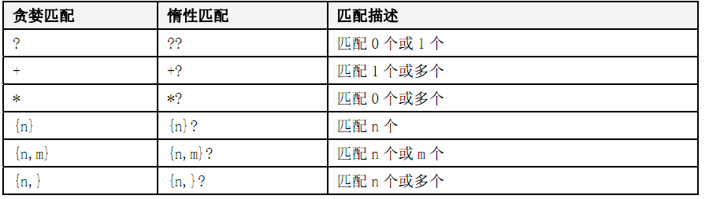
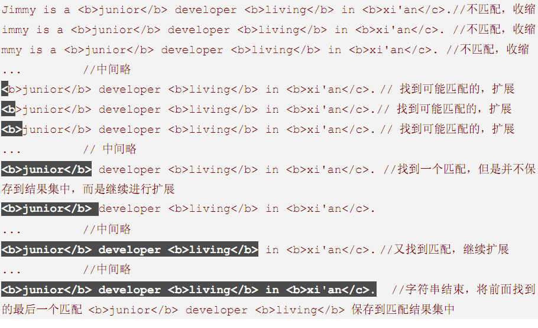
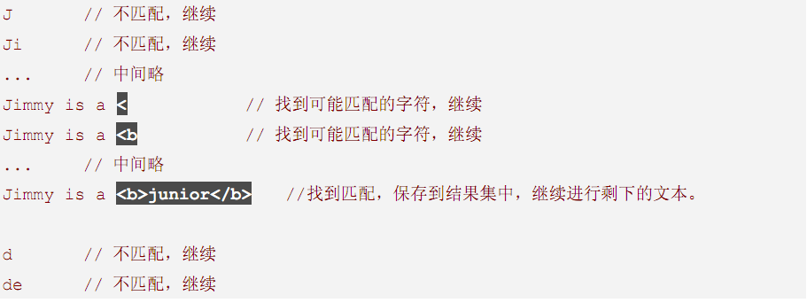
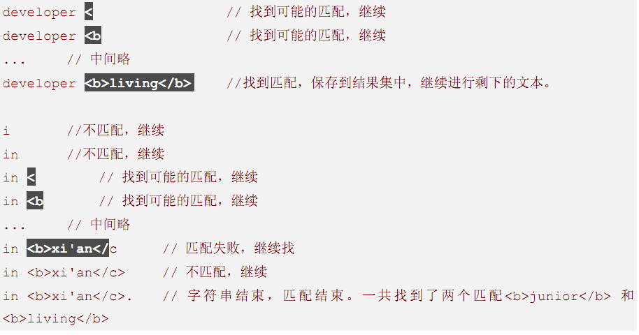

# 贪婪匹配和惰性匹配

### 一.贪婪匹配、惰性匹配概述 

我们首先从字面意思上来理解一下贪婪匹配和惰性匹配： 

<b>贪婪匹配</b> (greedy): 

它会匹配尽可能多的字符。它首先看整个字符串，如果不匹配，对字符串进行收缩；遇到可能匹配的文本，停止收缩，对文本进行扩展，当发现匹配的文本时，它不着急将该匹配保存到匹配集合中，而是对文本继续扩展，直到无法继续匹配 或者 扩展完整个字符串，然后将前面最后一个符合匹配的文本(也是最长的)保存起来到匹配集合中。所以说它是贪婪的。找到匹配的之后还是继续查找，若找到不合适的则返回最后一个匹配合适的。  

<b>惰性匹配</b> (lazy)： 

它会匹配尽可能少的字符，它从第一个字符开始找起，一旦符合条件，立刻保存到匹配集合中，然后继续进行查找。所以说它是懒惰的。 

光看上面的定义。找到匹配的之后，立即返回结果，然后再继续查找
我们很难有一个生动的认识，现在假设我们要匹配下面 <b>和</b> 之间的文本。为了做演示，尽管不符合 HTML 的定义，我们再加入一段<b>和</c>之间的文本。 

Source: 
 `Jimmy is a <b>junior</b> developer <b>living</b> in <b>xi'an</c>.`

RegEx： 
`<b>.*</b>`  

Result： 
`Jimmy is a <b>junior</b> developer <b>living</b> in <b>xi'an</c>.`

上面 Result 部分就是匹配得到的结果，这显然不是我们期望的结果，我们期望的结果是`<b>junior</b>`和`<b>living</b>`这两个结果。 

如果我们使用惰性匹配RegEx为：`<b>.*?</b>`则能匹配出我们期望的结果。 

贪婪匹配的过程： 

惰性匹配的过程： 

 

  这里有两个重要的匹配模式：一个是`"{n}"`,由于这个是精确的匹配几个字符，所以无论是贪婪"{n}"还是惰性"{n}?"其匹配结果是一致的。另外一个是"?"和"??"的区别。

  Source：These flowers are for you,my beloved

  regex:flowers?

  result:flowers

  如果regex:flowers?? 则result:flower 。其实原因很简单，贪婪匹配在查找到flower符合0个之后，还是贪婪的继续查找，找到flowers后还是符合，继续查找再找到flowers后面的空格发现不匹配，则返回最后匹配的flowers。而对于惰性匹配则在找到flower之后则立即返回。因此"??"其实是等价于"{0}"的。
   

  此博文参考自：http://www.tracefact.net/Misc/Regular-Expression-Tutorial.aspx