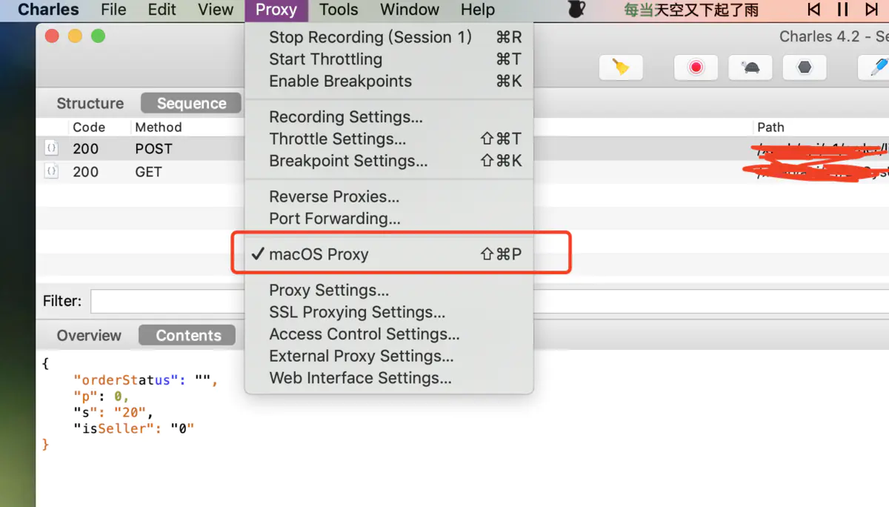
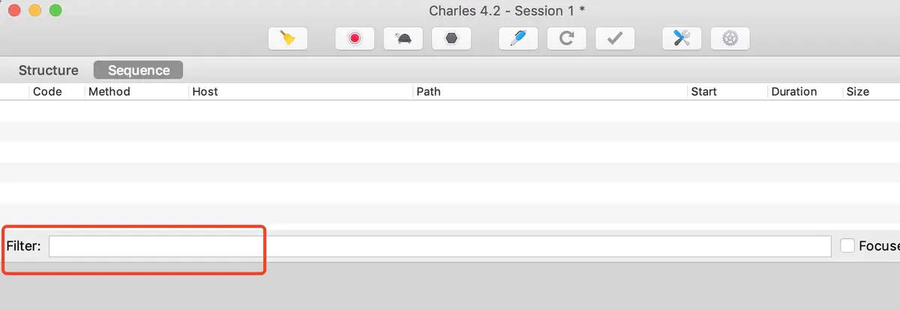
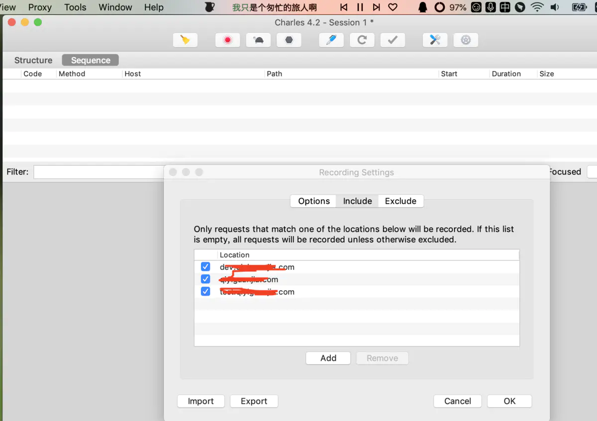
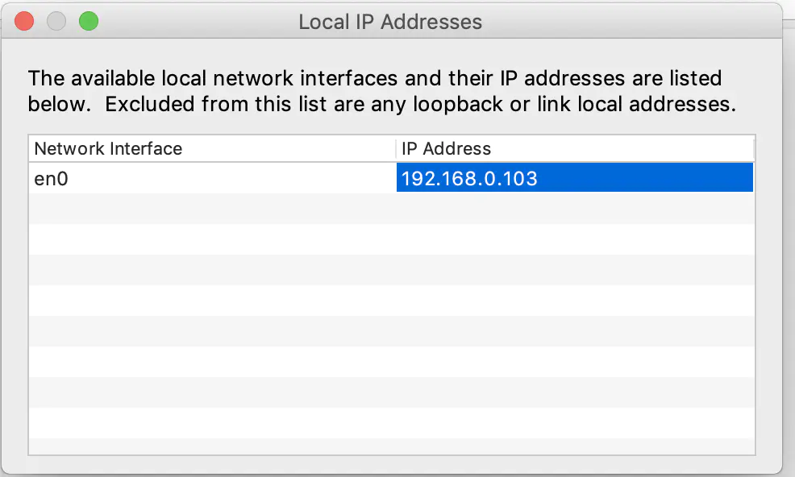
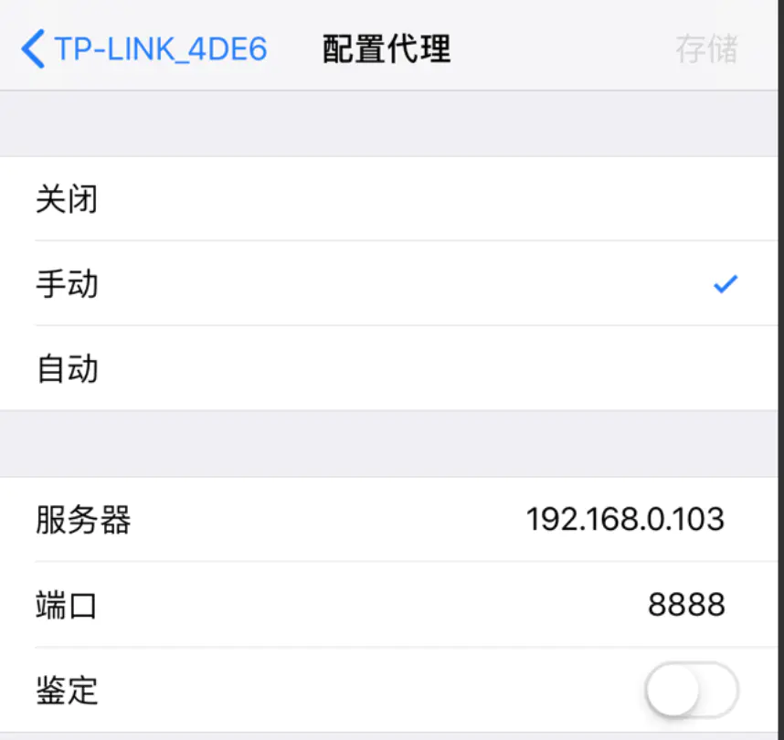
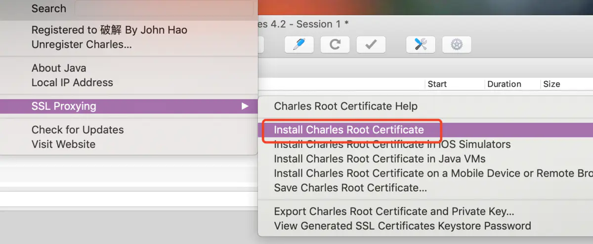
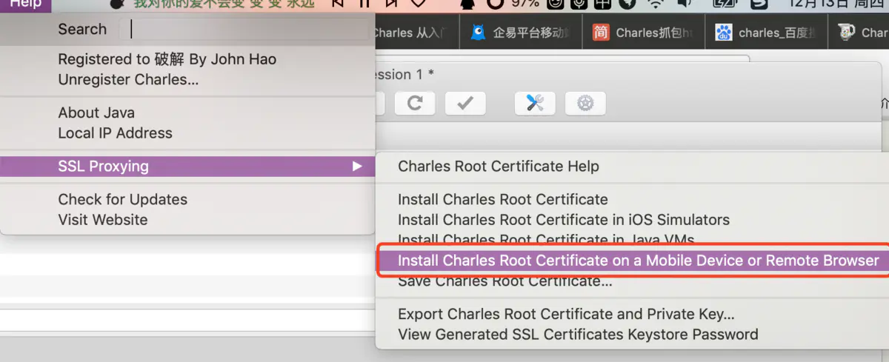
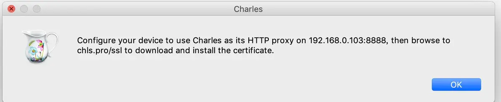
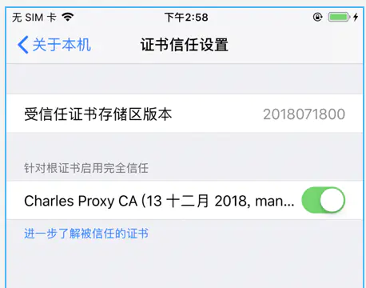

# CharlesMac破解版安装以及使用

前言

`Mac`上抓包使用青花瓷`Charles`，官网地址：`https://www.charlesproxy.com/`
破解版替换掉`chrales.jar`包，替换路径：`/Applications/Charles.app/Contents/Java` 

替换jar包：https://pan.baidu.com/s/13lbd44XfypMMW1Tv0XBqWQ 提取码：2ff5
安装啥就是一溜同意。

初步使用。

第 1 步：将其设置成系统的代理服务器。
启动 `Charles`后，第一次 `Charles` 会请求你给它设置系统代理的权限。你可以输入登录密码授予 `Charles` 该权限。你也可以忽略该请求，然后在需要将 `Charles` 设置成系统代理时，选择菜单中的 `“Proxy” -> “Mac OS X Proxy”`来将 `Charles` 设置成系统代理。

 

第 2步：设置过滤条件。

`Charles`主要提供两种查看封包的视图，分别名为 `“Structure”` 和 `“Sequence”`。
`Structure` 视图将网络请求按访问的域名分类。
`Sequence` 视图将网络请求按访问的时间排序。
如果需要添加条件过滤可以在`filter`里添加临时过滤条件。

 

如果需要整体过滤，可以在 `Charles` 的菜单栏选择 `“Proxy”->”Recording Settings`，然后选择 Include栏，选择添加一个项目，然后填入需要监控的协议，主机地址，端口号。（也可以点右上角的设置按钮里面选择Recording Settings）
guolv.png
第 3 步：将 `Charles` 的代理功能打开

在 Charles 的菜单栏上选择`“Proxy”->”Proxy Settings”`，填入代理端口`8888`，并且勾上 `“Enable transparent HTTP proxying”` 就完成了在`Charles` 上的设置。

  

第 4 步：手机上的设置。

首先我们需要获取 `Charles`运行所在电脑的 `IP` 地址，`Charles` 的顶部菜单的 `“Help”->”Local IP Address”`，即可在弹出的对话框中看到 `IP` 地址，如下图所示 

  

在 `iPhone` 的 “ 设置 “->” 无线局域网 “ 中，可以看到当前连接的 `wifi` 名，通过点击右边的详情键，可以看到当前连接上的 `wifi` 的详细信息，包括 `IP` 地址，子网掩码等信息。在其最底部有`「HTTP 代理」`一项，我们将其切换成手动，然后填上 `Charles` 运行所在的电脑的 `IP`，以及端口号 `8888`，如下图所示：

 

设置好之后，我们打开 `iPhone`上的任意需要网络通讯的程序，就可以看到 `Charles` 弹出`iPhone` 请求连接的确认，点击 `“Allow”`即可完成设置。

`Https`抓包

至此，以上配置好后基本上`Http`请求就可以抓包了。

如果是对`Https`进行抓包，还需要2步。

第 1 步：安装`Charles` 的`CA` 证书

如果你需要截取分析Https协议相关的内容。那么需要安装 Charles 的 CA 证书。具体步骤如下。首先我们需要在 Mac 电脑上安装证书。点击 Charles的顶部菜单，选择 “Help” -> “SSL Proxying” -> “Install Charles Root Certificate”，然后输入系统的帐号密码，即可在 KeyChain看到添加好的证书，然后信任证书即可。
 
 

第 2 步：如果我们需要在`iOS` 或 `Android` 机器上截取 `Https`协议的通讯内容，还需要在手机上安装相应的证书。点击   的顶部菜单，选择 `“Help” -> “SSL Proxying” -> “Install Charles Root Certificate on a Mobile Device or Remote Browser”`，然后就可以看到 Charles 弹出的简单的安装教程。如下图所示：

 

点击后出现下面的弹框

 

在手机上搜索`chls.pro/ssl`安装即可。

然后在手机上关于本机信任证书即可。
 
 

至此我们就可以对`Https`进行抓包。