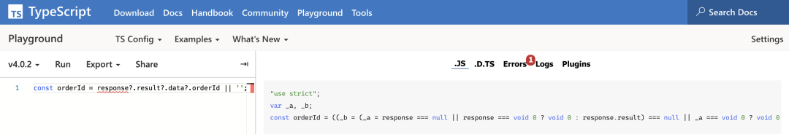

# TS关键词总结

最近一直在写TS,偶尔会遇到一些自己之前没见过的一些符号或者关键词，就随手记录下来，本篇文章就是对这段时间遇到的进行了总结。

## 目录概览
- TS中的一些符号
  - ! 断言操作符
  - ?. 链判断运算符
- TS中的一些关键词
  - type
  - interface
  - typeof
  - keyof
  - in
- TS中的一些内置类型
  - Partial 将类型的属性变成可选
  - Required将类型的属性变成必选
  - Pick 从某个类型中挑出一些属性出来
  - Record
  - Mutable 将类型的属性变成可修改
  - Readonly 类型的属性变成只读
  - ReturnType 用来得到一个函数的返回值类型 

> 下面的一些例子都可以在 TypeScript Playground[1] 中进行尝试。左侧是TS，右侧是编译后的JS。 



TS中的一些符号 

- ! 断言操作符
- ! 的作用是断言某个变量不会是 null/undefined，告诉编辑器停止报错。
``` javascript
const obj = {
    name: '牧码的星星'
}
```
`const a = obj!.name; `// 假设 obj是你从后端获取的获取
确定 `obj.name` 一定是存在的且不是`null/undefined`，使用`! `只是消除编辑器报错，不会对运行有任何影响。

属性或者参数中使用 !，表示强制解析(告诉 typescript 编译器，这里一定有值); 变量后使用 !: 表示类型推荐排除 null/undefined。

- ?. 链判断运算符 
``` javascript
const orderId = response.result.data.orderId;
```
上面这种写法，很容易出现这种问题 orderId is undefined，稍微有些经验的我们立马就能想到，肯定是代码中 response.result.data 为 null 或者 undefined ，这样，你肯定获取不到 orderId。所以经验丰富的我们在遇到获取层级比较多的对象的时候，一般都是像下面这样写。
``` javascript
// 正确的写法
const orderId = (response
  && response.result
  && response.result.data
  && response.result.data.orderId) || '';
```
我们可以使用 ?. 来简化上面的代码。
``` javascript
const orderId = response?.result?.data?.orderId || '';
```
上面代码使用了?.运算符，直接在链式调用的时候判断，左侧的对象是否为null或undefined。如果是的，就不再往下运算，而是返回undefined。

 - ?. 支持如下语法
``` javascript
obj?.prop // 对象属性
obj?.[expr] // 对象属性
arr?.[index] // 获取数据中 index 下标对应的值
func?.(...args) // 函数或对象方法的调用
```
> ?.和 && 的区别

## TS中的一些关键词
### type 类型别名用来给一个类型起个新名字
``` ts
type SetUser = (name: string, age: number) => void;
```
类型别名常用于联合类型(联合类型表示取值可以为多种类型中的一种)，比如常见的如下写法
``` ts
type UploadType = 'drag' | 'select';
```
## interface
### interface 和 type 的用法其实差不多，interface 也是用来定义类型的
``` ts
interface SetUser = {
    (name: string, age: number) => void;
}
```
### type和interface的区别
都支持拓展，但是语法不同
``` ts
interface Name { 
  name: string; 
}
interface User extends Name { 
  age: number; 
}
type Name = { 
  name: string; 
}
type User = Name & { age: number  };
```
### typeof 可以获取一个变量的声明类型
在 JavaScript 中， typeof 可以判断一个变量的基础数据类型， 在 TS 中，它还可以获取一个变量的声明类型
``` javascript
const obj = { a: '1' };
type Foo = typeof obj; 
// type Foo = { a: string }
```
### keyof 可以获取一个对象接口的所有 key 值
``` ts
type Obj = { a: string; b: string }
type Foo = keyof obj;
// type Foo = 'a' | 'b';
```
### in 可以遍历枚举类型
``` ts
type Keys = 'a' | 'b' | 'c';
type Obj = { 
    [ T in Keys]: string;
}
// in 遍历 Keys，并为每个值赋予 string 类型

// type Obj = {
//     a: string,
//     b: string,
//     c: string
// }
```
## TS中一些内置的类型
官方文档：https://www.typescriptlang.org/docs/handbook/utility-types.html#partialt

用到了上面提到的一些关键词

### Partial 将类型的属性变成可选
功能是将类型的属性变成可选，注意这是浅Partial
``` ts
type Partial = { 
    [P in keyof T]?: T[P] 
};
```
举例说明
``` ts
interface UserInfo {
    id: string;
    name: string;
}

// error：Property 'id' is missing in type '{ name: string; }' but required in type 'UserInfo'
const xiaoming: UserInfo = {
    name: 'xiaoming'
}
```
使用  Partial
``` ts
type NewUserInfo = Partial;const xiaoming: NewUserInfo = {name: 'xiaoming'
}
```
这个  NewUserInfo 就相当于
``` ts
interface NewUserInfo {
    id?: string;
    name?: string;
}
```
但是 Partial 有个局限性，就是只支持处理第一层的属性，如果我的接口定义是这样的
``` ts
interface UserInfo {
    id: string;
    name: string;
    fruits: {
        appleNumber: number;
        orangeNumber: number;
    }
}

type NewUserInfo = Partial;// Property 'appleNumber' is missing in type '{ orangeNumber: number; }' but required in type '{ appleNumber: number; orangeNumber: number; }'.const xiaoming: NewUserInfo = {name: 'xiaoming',fruits: {orangeNumber: 1,
    }
}
```
可以看到，第二层以后就不会处理了，如果要处理多层，就可以自己通过  Conditional Types[2]

DeepPartial
``` ts
type DeepPartial = {// 如果是 object，则递归类型
    [U in keyof T]?: T[U] extends object
      ? DeepPartial
      : T[U]
};
type PartialedWindow = DeepPartial; // 现在window 上所有属性都变成了可选啦
```
### Required将类型的属性变成必选
``` ts
type Required = { 
    [P in keyof T]-?: T[P] 
};
```
其中 -? 是代表移除 ? 这个 modifier 的标识。再拓展一下，除了可以应用于 ? 这个 modifiers ，还有应用在 readonly ，比如 Readonly 这个类型
``` ts
type Readonly = {
    readonly [p in keyof T]: T[p];
}
```
### Pick 从某个类型中挑出一些属性出来
``` ts
type Pick = {
    [P in K]: T[P];
};
interface UserInfo {
    id: string;
    name: string;
}
type NewUserInfo = Pick'name'>; // {name: string;}
```
可以看到 NewUserInfo 中就只有个 name 的属性了。

### Record
可以获得根据 K 中所有可能值来设置 key 以及 value 的类型
``` ts
type Record = {
    [P in K]: T;
};
```
举个例子
``` ts
type CurRecord = Record<'a' | 'b' | 'c', UserInfo>; // { a: UserInfo; b: UserInfo; c: UserInfo; }
```
### Mutable 将类型的属性变成可修改
功能是将类型的属性变成可修改，这里的 -指的是去除。-readonly 意思就是去除只读，也就是可修改啦。
``` ts
type Mutable = {
  -readonly [P in keyof T]: T[P];
};
```
### Readonly 类型的属性变成只读
``` ts
type Readonly = { 
    readonly [P in keyof T]: T[P] 
};
```
### ReturnType 用来得到一个函数的返回值类型
``` ts
type ReturnType any> = T extends (
  ...args: any[]
) => infer R
  ? R
  : any;
```
infer在这里用于提取函数类型的返回值类型。ReturnType 只是将 infer R 从参数位置移动到返回值位置，因此此时 R 即是表示待推断的返回值类型。

下面的示例用ReturnType获取到 Func 的返回值类型为 string，所以，foo 也就只能被赋值为字符串了。
``` ts
type Func = (value: number) => string;

const foo: ReturnType = "1";
``` 

更多参考TS - es5.d.ts[3]

# 参考
细数 TS 中那些奇怪的符号[4]
TypeScript中高级应用与最佳实践[5]
TS 中的内置类型简述[6]
TypeScript 的工具类型[7]
深入理解 TypeScript[8]
## 参考资料
[1]
TypeScript Playground: https://www.typescriptlang.org/play

[2]
Conditional Types: https://www.typescriptlang.org/docs/handbook/release-notes/typescript-2-8.html

[3]
TS - es5.d.ts: https://github.com/microsoft/TypeScript/blob/master/src/lib/es5.d.ts#L1431

[4]
细数 TS 中那些奇怪的符号: https://segmentfault.com/a/1190000023943952

[5]
TypeScript中高级应用与最佳实践: https://juejin.im/post/6844903904140853255#heading-9

[6]
TS 中的内置类型简述: https://github.com/whxaxes/blog/issues/14

[7]
TypeScript 的工具类型: https://zhuanlan.zhihu.com/p/78180787

[8]
深入理解 TypeScript: https://jkchao.github.io/typescript-book-chinese/
