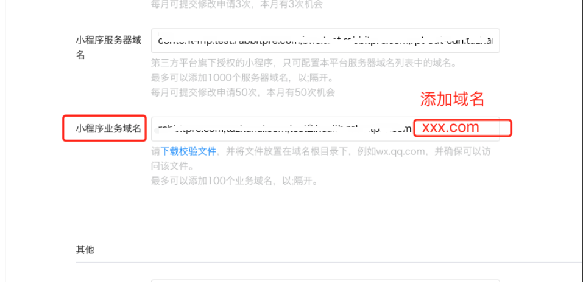
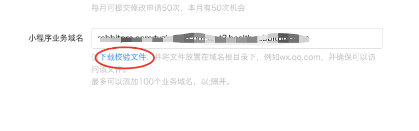

# 小程序 webview 跳转到H5链接

注意：链接需是https

## 1、登录小程序微信开放平台，配置小程序业务域名
--- 

最多可以添加100个业务域名，以;隔开。

### 注意：

  - 目前的规则是业务域名支持匹配二级域名，服务器域名是不可以的（官方考虑后续支持）

  - 如果该小程序有授权给第三方平台，需在第三方平台添加域名

## 2、下载校验文件
---

将文件放置在域名根目录下，并确保浏览器可以访问到该文件